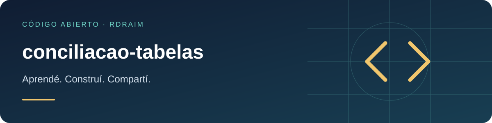

<p align="right">
  <a href="README.md"></a>
  <a href="README.en-US.md"></a>
  <a href="README.es-AR.md"></a>
</p>

# conciliacao-tabelas



<!-- public-badges:start -->
[](LICENSE) [](https://github.com/Rdraim/conciliacao-tabelas/actions) [](https://github.com/Rdraim/conciliacao-tabelas/releases)
<!-- public-badges:end -->

<p>
  <a href="https://github.com/Rdraim/conciliacao-tabelas/tree/main/examples"></a>
  <a href="https://github.dev/Rdraim/conciliacao-tabelas"></a>
  <a href="https://github.com/Rdraim/conciliacao-tabelas/archive/refs/heads/main.zip"></a>
</p>


Compará tablas por una clave estable y revisá altas, bajas y cambios por campo.

## Instalación

```bash
git clone https://github.com/Rdraim/conciliacao-tabelas.git
cd conciliacao-tabelas
npm test
node examples/basic.mjs
```

## Ejemplo ejecutable

```js
import {conciliar} from './src/index.js';
console.log(conciliar([{id:'A',valor:100}],[{id:'A',valor:110},{id:'B',valor:20}],{campos:['valor']}));
```

## API

`conciliar(anterior, actual, {chave: "id", campos?})` devuelve `incluidos`, `removidos`, `alterados` e `iguais`. Claves ausentes o duplicadas lanzan TypeError. `campos` selecciona campos.

## Límites

Comparación superficial con Object.is; normalizá números, fechas y objetos primero. No hace coincidencia aproximada, conversión monetaria ni acceso a bases.

## Compatibilidad

Núcleo sin dependencias de ejecución. CI con Node.js 22 y 24. Instalación desde Git; este proyecto no está publicado en npm. Revisá Releases y fijá una tag/commit al integrar. Actualizaciones requieren revisar licencia, engines y pruebas del consumidor. Un badge de CI no certifica seguridad.

[Compatibilidad](COMPATIBILITY.es-AR.md) · [Contribuciones](CONTRIBUTING.es-AR.md) · [Seguridad](SECURITY.es-AR.md)

MIT © Rodrigo Rodrigues

## ☕ Invitame un café

¿Este proyecto te ayudó a resolver un problema, aprender algo nuevo o dar tus primeros pasos en desarrollo? Si querés apoyar mi trabajo, un café es una linda forma de agradecer.

Soy **Rodrigo Rodrigues**, creador de **Nexus** y de estos proyectos de código abierto. Tu aporte me ayuda a dedicar tiempo a mejorar el código, escribir ejemplos más claros y seguir compartiendo lo que aprendo.

**Aportá el monto que tenga sentido para vos. El apoyo es totalmente voluntario; el proyecto sigue siendo gratuito bajo la licencia MIT.**

[Apoyá con Pix](#apoyá-con-pix) · [Dejá un comentario](https://github.com/techrodrigo21-ux/conciliacao-tabelas/issues/new?title=Comentario%3A%20este%20proyecto%20me%20ayud%C3%B3)

### Apoyá con Pix

En la app de tu banco, escaneá el QR o copiá la clave Pix de abajo. Elegí el monto y revisá los datos del destinatario antes de confirmar.

<p align="center">
  
</p>

**Clave Pix**

```text
8875a24e-44d1-4c91-b6bb-62c9f0070955
```

Pix es el sistema de pagos de Brasil. Si tu banco no lo admite, también podés ayudar compartiendo el proyecto, reportando un problema, mejorando la documentación o dejando un comentario.

### Tu comentario también suma

[Contame cómo te ayudó el proyecto](https://github.com/techrodrigo21-ux/conciliacao-tabelas/issues/new?title=Comentario%3A%20este%20proyecto%20me%20ayud%C3%B3). Me gustaría saber qué creaste, qué aprendiste y qué podría ser más claro para quienes recién empiezan.

Los comentarios son bienvenidos con o sin donación. Cuidá tu privacidad: no publiques comprobantes de pago, datos personales, credenciales ni información privada de usuarios en las Issues.

**Gracias por apoyar mi trabajo y ayudarme a seguir creando y compartiendo. ❤️**
